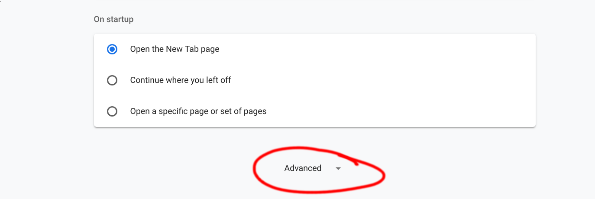
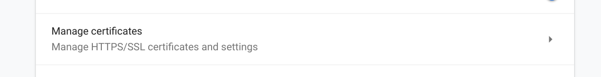
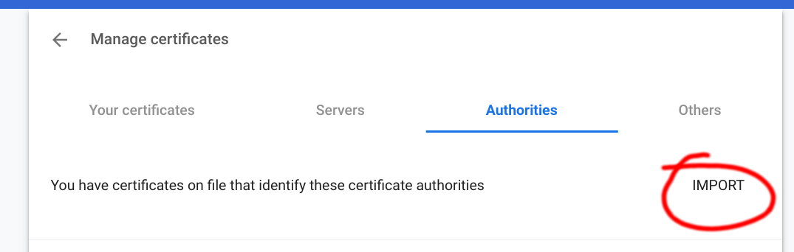
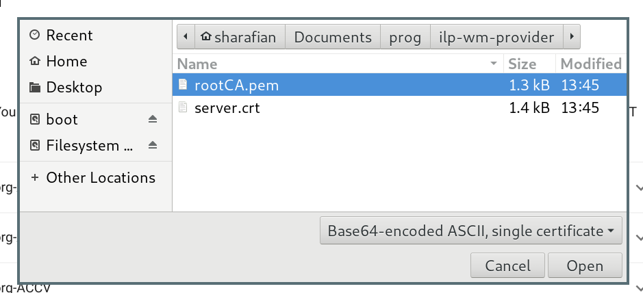
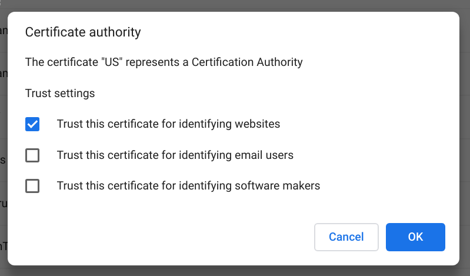

# ILP Web Monetization Provider
> Enable Web Monetization using your own XRP wallet

## Setup

WM providers must run over HTTPS. However, `ilp-wm-provider` runs locally.
This means that you'll need a self-signed certificate.

### Generate Certs

```sh
# Generate root ssl cert.  When it asks you to generate a password remember
# what you put; you'll need it to sign your cert.  You can enter 'Example' on
# any of the other questions where it prompts you
openssl genrsa -des3 -out ./cert/rootCA.key 2048
openssl req -x509 -new -nodes -key ./cert/rootCA.key -sha256 -days 1024 -out ./cert/rootCA.pem

# Generate domain ssl cert
openssl req -new -sha256 -nodes -out ./cert/server.csr -newkey rsa:2048 -keyout ./cert/server.key -config <( cat ./cert/server.csr.cnf )
openssl x509 -req -in ./cert/server.csr -CA ./cert/rootCA.pem -CAkey ./cert/rootCA.key -CAcreateserial -out ./cert/server.crt -days 500 -sha256 -extfile ./cert/v3.ext
```

### Trust Certs

Now you have to add your certificate authority to your browser so you can use
it on websites. These instructions are for google chrome, but there exist similar
options on any other browser that can be found with some googling.

First, open the "Advanced" settings in google chrome on
[`chrome://settings`](chrome://settings).



Next, go to "Manage Certificates."



Once you're there, go to the "Authorities" tab and click "Import."



Navigate to the `rootCA.pem` file in the `cert` folder in this repository.



Select "Trust this certificate for identifying websites," and then confirm by
hitting "OK."



Now your server will be able to run SSL locally!

### Start the Provider

Now you can run your provider with:

```sh
ilp-wm-provider --web-port 7771 --ws-port 7772
```

And navigate to [https://localhost:7771](https://localhost:7771).

## Environment Variables

- `WEB_PORT` - Which port to run the webserver on (default `7771`)

- `WS_PORT` - Which port to run the BTP server on (default `7772`)

- `MONEYD_URI` - The uri to connect to for moneyd access (default `btp+ws://localhost:7768`)

- `THROUGHPUT` - Throughput in units/second. These are the same units as your
  moneyd. The default value is `100`, which would be 100 drops/second on
moneyd-uplink-xrp.

